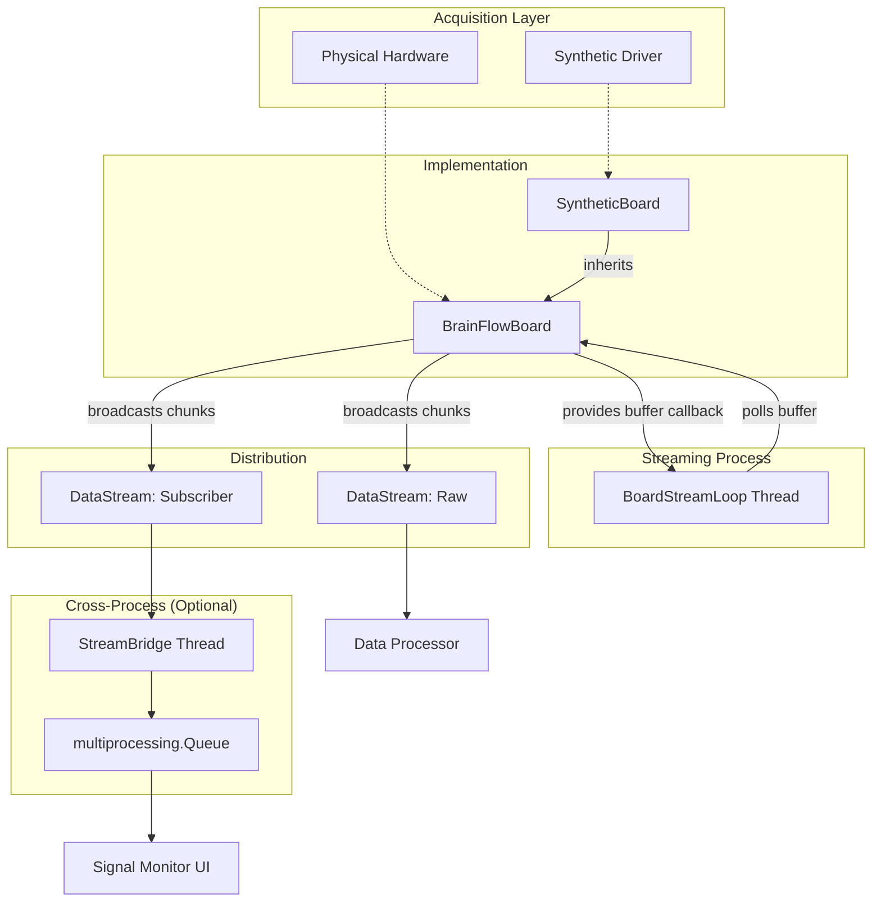

# Board Module Manual

The `board` module provides a unified interface for EEG data acquisition, supporting both physical hardware (via BrainFlow) and synthetic data for development.

## Architecture

The module is designed around an asynchronous polling architecture to ensure low-latency data retrieval without blocking the main application thread.



### Core Components

- **`BoardInterface` (base.py)**: An abstract base class defining the contract for all board implementations. It handles subscriber management and defines methods for opening/closing connections and starting/stopping streams.
- **`BrainFlowBoard` (brainflow_board.py)**: The primary implementation for physical hardware. it wraps BrainFlow's `BoardShim` and manages a background thread for continuous data polling.
- **`SyntheticBoard` (synthetic.py)**: A specialized version of `BrainFlowBoard` that uses BrainFlow's synthetic driver. Ideal for testing and development without hardware.
- **`DataStream` (stream.py)**: A thread-safe wrapper around `queue.Queue` used to pass data chunks from the acquisition thread to consumers.
- **`BoardStreamLoop` (streaming.py)**: The internal logic that runs in a background thread, periodically polling the hardware buffer and broadcasting data to all registered `DataStream` subscribers.
- **`StreamBridge` (bridge.py)**: A utility to forward data from a `DataStream` to a multiprocessing queue, enabling cross-process data sharing (essential for UI visualizers).

## Usage

### Basic Initialization and Streaming

To start receiving data from a board:

```python
from bci.board import BrainFlowBoard, BoardStatus

# Initialize (e.g., Cyton board is ID 0)
board = BrainFlowBoard(board_id=0)

# Open the connection
board.open()

# Start the background streaming thread
board.start_stream()

# Get the raw stream to consume data
raw_stream = board.get_raw_stream()

try:
    while True:
        # Get data chunk (numpy array)
        chunk = raw_stream.get(timeout=1.0)
        print(f"Received chunk with shape: {chunk.shape}")
finally:
    board.stop_stream()
    board.close()
```

### Using the Synthetic Board

The `SyntheticBoard` is drop-in compatible with `BrainFlowBoard`:

```python
from bci.board import SyntheticBoard

board = SyntheticBoard(n_channels=8, sampling_rate=250)
board.open()
board.start_stream()
# ... consume data ...
```

### Subscribing Multiple Consumers

You can add multiple `DataStream` objects to a single board instance. Each subscriber will receive a copy of every data chunk.

```python
from bci.board import DataStream

extra_stream = DataStream()
board.add_subscriber(extra_stream)

### Advanced Control

The board interface supports inserting markers into the data stream:

```python
# Insert a marker (e.g., event code) into the data stream
board.insert_marker(1.0)
```

## Data Format

Data chunks are provided as 2D NumPy arrays (`NDArray[np.float64]`).
- **Rows**: Channels (EEG, Accelerometer, Time, etc.).
- **Columns**: Samples.

### EEG Channels

The specific EEG channel indices vary depending on the board hardware. You can retrieve them via the `eeg_channel_indices` property:

```python
eeg_indices = board.eeg_channel_indices
# e.g., (1, 2, 3, 4, 5, 6, 7, 8)
```

### Board Status

The `get_status()` method returns a `BoardStatus` object containing metadata about the current session:

```python
status = board.get_status()
print(f"Connected: {status.is_open}")
print(f"Streaming: {status.is_streaming}")
print(f"Sampling Rate: {status.sampling_rate} Hz")
```

## Implementation Details

- **Thread Safety**: All streaming operations are thread-safe. `DataStream` uses a blocking queue by default.
- **Polling Interval**: The default polling interval is 50ms (`POLL_INTERVAL_SEC = 0.05`), which provides a good balance between latency and CPU usage.
- **Error Handling**: The `BoardStreamLoop` and `StreamBridge` are designed to silently handle full queues to prevent the acquisition thread from hanging.
