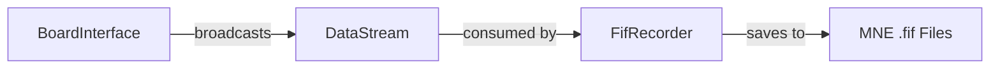

# Recorder Module Manual

The `recorder` module is responsible for persisting streamed EEG data to disk. It provides a standardized interface for different recording backends, with the primary implementation being the `FifRecorder` for MNE-compatible `.fif` files.

## Architecture

The module follows a consumer-producer pattern where a recorder instance subscribes to a `DataStream` (typically from a `BoardInterface`) and processes data in a background thread.



### Core Components

- **`RecorderInterface` (base.py)**: The abstract base class defining the standard recording lifecycle:
    - `start()`: Initializes resources and begins the recording loop.
    - `stop()`: Finalizes the file and releases resources.
    - `write(chunk)`: Appends a data chunk to the recording.
- **`FifRecorder` (fif.py)**: The primary implementation for saving data in the Electrophysiology (MNE) `.fif` format.
    - Runs a background thread (`FifRecorderThread`) to consume data from its own internal `DataStream`.
    - Supports pausing/resuming recording (useful for discarding data between experimental blocks).
    - Tracks timing statistics for data arrival.

## Usage

### Basic Recording

To record data from a board:

```python
from bci.board import SyntheticBoard
from bci.recorder import FifRecorder

# 1. Setup the board
board = SyntheticBoard()
board.open()

# 2. Setup the recorder
recorder = FifRecorder(
    board_id=board.get_status().board_id,
    recording_dir="./data/recordings",
    participant_id="P001",
    fs=250.0
)

# 3. Connect them
# FifRecorder has its own internal DataStream: recorder.stream
board.add_subscriber(recorder.stream)

# 4. Start recording
recorder.start()
board.start_stream()

try:
    # Record for 10 seconds
    import time
    time.sleep(10)
finally:
    # 5. Cleanup
    recorder.stop()
    board.stop_stream()
    board.close()
```

### Pausing and Resuming

You can pause a recording without stopping the background thread. Data received while paused is discarded.

```python
recorder.start()

# Recording session 1
time.sleep(5)

recorder.pause()
# Data arriving now is ignored
time.sleep(2)

recorder.resume()
# Recording session 2
time.sleep(5)

recorder.stop()
```

## Data Persistence

The `FifRecorder` typically saves data using the `visualizer.utils.common.save_raw` utility (or a local fallback). It converts the accumulated NumPy chunks into an MNE Raw object before saving.

## Implementation Details

- **Thread Safety**: The `FifRecorder` processes data in a dedicated daemon thread to ensure that disk I/O does not block the data acquisition or UI threads.
- **Timing Stats**: The recorder tracks the interval between incoming chunks (`_window_durations`) which can be used for quality control and debugging jitter in the stream.
